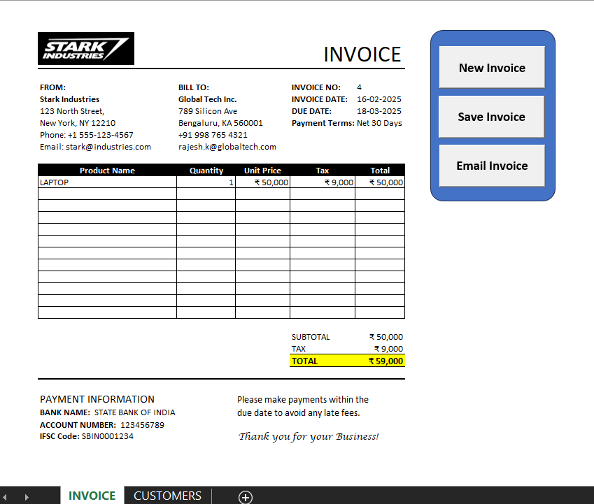

# Excel Invoice Automation (VBA & Macros)
This project is an **automated invoicing system** built using **Excel VBA** and formulas. It streamlines invoice generation, saves invoices as PDFs, and integrates with **Outlook** for email automation. AI-assisted coding was used to enhance efficiency and accuracy.

## 🔹 Features
- **Automated Invoice Generation:** Auto-fills customer details using `INDEX-MATCH`.  
- **PDF Export:** Saves invoices as **PDF** files for record-keeping.  
- **Email Integration:** Sends invoices via **Outlook automation**.  
- **Auto-Increment Invoice Number:** Ensures unique invoice numbers for each transaction.  
- **Data Validation:** Prevents errors by applying formulas for tax calculations and totals.  

## 🔹 Technologies Used
- **Excel VBA (Macros)**
- **Excel Formulas (`INDEX-MATCH`, `SUM`, `IFERROR`)**
- **Outlook Automation**
- **AI Assistance (ChatGPT for VBA Optimization)**

## 🚀 Setup Instructions
1. **Download** the Excel file from this repository.  
2. Open Excel and enable **Macros (VBA)** under Developer Settings.  
3. Modify the file path in the VBA script (`PDF()` function) for saving invoices.  
4. Use the `New Invoice` button to generate a fresh invoice.  
5. Click `Save as PDF` to export, or `Email Invoice` to send via Outlook.  

## 📸 Screenshots  
*(Upload images of your Excel project for better visibility.)*  

## 📜 License
This project is open-source and available under the **MIT License**.  

---

